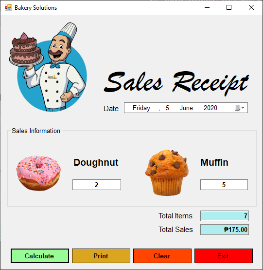

# Week 2: Bakery Solution

<p align="center">
  
</p>

## Events

### ...when user clicks *Calculate* button
```
Private Sub btnCalculate_Click(sender As Object, e As EventArgs) Handles btnCalculate.Click
        Dim totalItems As Integer = Val(txtDonut.Text) + Val(txtMuffin.Text)
        Dim totalSales As Decimal = totalItems * 25
        txtTotalItems.Text = totalItems
        txtTotalSales.Text = FormatCurrency(totalSales, 2)
End Sub
```

### ...when user clicks *Print* button
```
Private Sub btnPrint_Click(sender As Object, e As EventArgs) Handles btnPrint.Click
        btnCalculate.Hide()
        btnPrint.Hide()
        btnClear.Hide()
        btnExit.Hide()
        printMain.Print()
        btnCalculate.Show()
        btnPrint.Show()
        btnClear.Show()
        btnExit.Show()
End Sub
```

### ...when user clicks *Clear* button
```
Private Sub btnClear_Click(sender As Object, e As EventArgs) Handles btnClear.Click
        txtDonut.Clear()
        txtDonut.Focus()
        txtMuffin.Clear()
        txtTotalItems.Clear()
        txtTotalSales.Clear()
End Sub
```

### ...when user clicks *Exit* button
```
Private Sub btnExit_Click(sender As Object, e As EventArgs) Handles btnExit.Click
        Me.Close()
End Sub
```